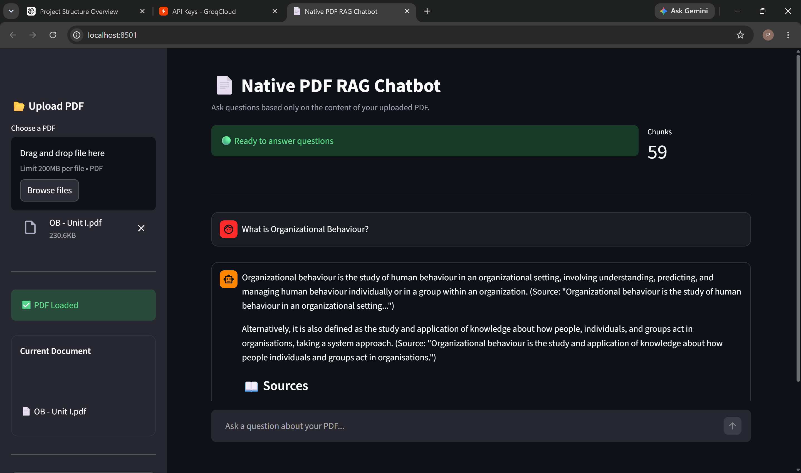

# 📄 Native PDF RAG Chatbot

A **Retrieval-Augmented Generation (RAG)** based PDF Question Answering System built using **Python, Streamlit, FAISS, Sentence Transformers, and the Groq API**.

This application enables users to upload PDF documents, convert them into semantic chunks, retrieve relevant information using semantic search, and generate context-aware answers using the **Groq Llama 3.3 model**.

---

## 🚀 Features

- 📂 Upload PDF documents
- 📄 Extract text from PDF files
- ✂️ Intelligent text chunking
- 🧠 Generate embeddings using Sentence Transformers
- 🔍 Semantic similarity search using FAISS
- 🤖 AI-powered answers using Groq (Llama 3.3)
- 💬 Interactive Streamlit web interface
- ⚡ Fast and accurate document-based question answering

---

## 📸 Application Output

The screenshot below demonstrates the chatbot answering questions based on the uploaded PDF.



---

## 🛠️ Tech Stack

- Python
- Streamlit
- FAISS
- Sentence Transformers
- PyMuPDF (fitz)
- Groq API
- LangChain
- NumPy
- Pandas

---

## 📂 Project Structure

```text
PDF-CHRUNK-RAG/
│
├── app.py
├── pdf_processor.py
├── chunker.py
├── embeddings.py
├── retriever.py
├── llm.py
├── requirements.txt
├── runtime.txt
├── render.yaml
├── screenshots/
│   └── output.png
├── data/
└── README.md
```

---

## ⚙️ Installation

### 1. Clone the Repository

```bash
git clone https://github.com/karthiiiiiiiiiiiii/PDF-CHRUNK-RAG.git
cd PDF-CHRUNK-RAG
```

### 2. Create a Virtual Environment

```bash
python -m venv venv
```

**Windows**

```bash
venv\Scripts\activate
```

**Linux / macOS**

```bash
source venv/bin/activate
```

### 3. Install Dependencies

```bash
pip install -r requirements.txt
```

---

## 🔑 Configure the Groq API

Create a `.env` file in the project directory and add:

```env
GROQ_API_KEY=your_groq_api_key
```

Get your API key from:
https://console.groq.com/keys

---

## ▶️ Run the Application

```bash
streamlit run app.py
```

Open your browser:

```text
http://localhost:8501
```

---

## 📖 How It Works

1. Upload a PDF document.
2. Extract text from the uploaded PDF.
3. Split the content into semantic chunks.
4. Generate embeddings using Sentence Transformers.
5. Store embeddings in a FAISS vector database.
6. Ask questions related to the uploaded PDF.
7. Retrieve the most relevant chunks using semantic search.
8. Send the retrieved context to the Groq Llama model.
9. Display an accurate answer based on the uploaded document.

---

## 🎯 Use Cases

- 📚 Academic PDF Question Answering
- 📄 Research Paper Analysis
- 🔍 Intelligent Document Search
- 📖 Study Material Assistant
- 🧠 Knowledge Base Chatbot

---

## 🚀 Future Enhancements

- 📂 Support multiple PDF uploads
- 💬 Chat history
- 📄 Display source page references
- 🌐 Multi-language support
- ☁️ Cloud deployment
- 🔐 User authentication

---

## 👩‍💻 Author

**Pragna**

🎓 IT Undergraduate | BRECW, Hyderabad

Passionate about Artificial Intelligence, Retrieval-Augmented Generation (RAG), Machine Learning, and Full-Stack Web Development.

---

## ⭐ Support

If you found this project useful, consider giving it a ⭐ on GitHub!
